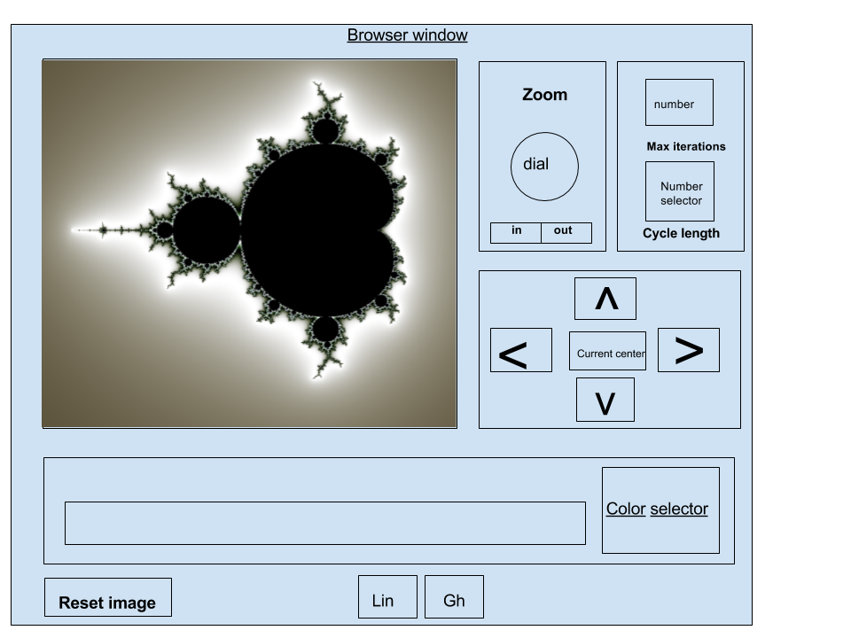

## Fractalscope

### Background

The Mandlebrot set is a famous fractal which shows the beauty and chaos
that emerge when complex numbers are repeatedly subjected to polynomial
transformations. It is named after Benoit Mandlebrot, a Polish-born
mathematician who poineered the field of 'fractal geometry' and the use
of computers to generate fractal images. He discovered the Mandlebrot set
in 1979.

They algorithm that generates this canonical fractal is:
  Z(i + 1) = (Z(i))^2 + k
where k is the value of a point on the complex plane. Images of this
fractal are generated by calculating repeated iterations of the above
function, and testing to see if the value of Z(i) has escaped from a
predetermined boundary. Typically the boundary is set to abs(Z(i)) < 4,
since numbers greater than 4 will grow quickly when squared. Complex
numbers less than 4, however do not all diverge under this function,
since the 'imaginary' component may square to a negative 'real' value.

The image displayed is generated by applying this calculation to each
point on the complex plane, and coloring the corresponding pixel based
on how many iterations of the function it takes to escape the boundary.
Points that remain bounded are in the set. Points that escape will be
assigned a color depending on the number of iterations it takes to
diverge.

[more info](https://en.wikipedia.org/wiki/Mandelbrot_set)

### Functionality & MVP  

This fractalscope will be able to:

- [ ] render the Mandlebrot set image.
- [ ] Zoom in or out on a given location in the complex plane.
- [ ] Pan the center location.
- [ ] Export, save, or download the image.

In addition, this project will include:

- [ ] A link to the Mandlebrot Set wikipedia package
- [ ] Links to my personal page, the github repo, and my LinkedIn
- [ ] A production Readme

### Wireframes

This project will be a single interactive panel with a large canvas
element and various control panels around it. The user will be able to
make adjustments to the image by clicking on the control panels.

### Architecture and Technologies

#### Technologies
This project will be implemented with the following technologies:

- Vanilla Javascript
- 'jscolor' for color picking,
- `HTML5 Canvas` for image rendering,
- Webpack to bundle, transpile, and serve up the various scripts.
