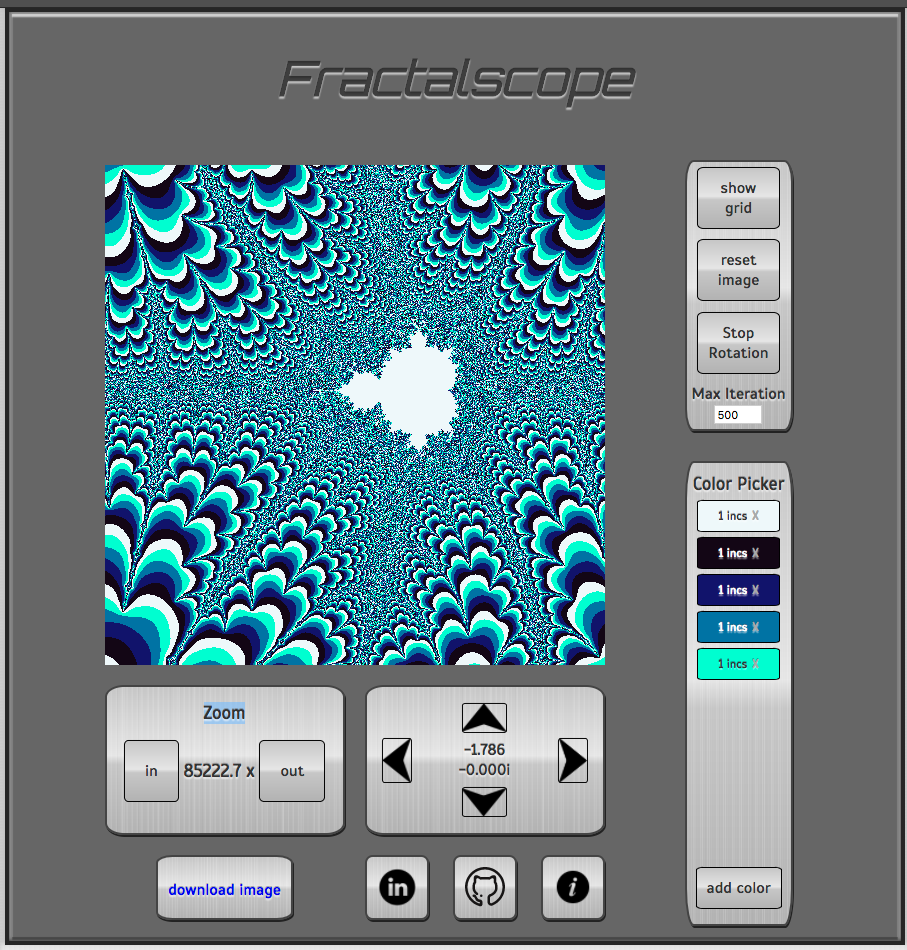
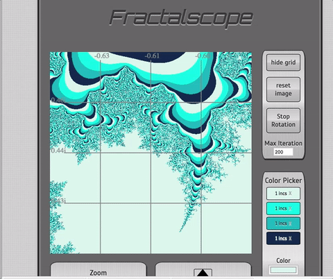

## Fractalscope

### Background

The Mandlebrot set is a famous fractal which shows the beauty and chaos
that emerge when complex numbers are repeatedly subjected to polynomial
transformations. It is named after Benoit Mandlebrot, a Polish-born
mathematician who poineered the field of 'fractal geometry' and the use
of computers to generate fractal images. He discovered the Mandlebrot set
in 1979.

They algorithm that generates this canonical fractal is:
  Z(i + 1) = (Z(i))^2 + k
where k is the value of a point on the complex plane. Images of this
fractal are generated by calculating repeated iterations of the above
function, and testing to see if the value of Z(i) has escaped from a
predetermined boundary. Typically the boundary is set to abs(Z(i)) < 4,
since numbers greater than 4 will grow quickly when squared. Complex
numbers less than 4, however do not all diverge under this function,
since the 'imaginary' component may square to a negative 'real' value.

The image displayed is generated by applying this calculation to each
point on the complex plane, and coloring the corresponding pixel based
on how many iterations of the function it takes to escape the boundary.
Points that remain bounded are in the set. Points that escape will be
assigned a color depending on the number of iterations it takes to
diverge.

[more info](https://en.wikipedia.org/wiki/Mandelbrot_set)

### Architecture and Technologies

#### Technologies
This project is implemented with the following technologies:

- Vanilla Javascript
- `HTML5 Canvas` for image rendering
- `HTML5 Color Input` for choosing colors
- Webpack to bundle, transpile, and serve up the various scripts.

#### Architecture
Rendering the Mandlebrot set with canvas requires several layers of nested
functions. At the top level, a simple scaling function is used to map the
pixels of the canvas to points along the Complex plane. This process is
handled in the drawMandlebrot Function which lives in the draw_mandlebrot.js
file. In order to render the Mandlebrot set, these points must then be expanded
by iteratively applying the Mandlebrot function (Z = Z^2 + C) and checking
how many iterations are required to 'escape.' This process is handled in a
function called expandMandlebrot which lives in the dedicated JavaScript file
expand_mandlebrot.js.

Colors are stored in a custom-designed 'color object' called colorObj locally.
This object has integer keys which correspond to iteration widths. For example
if a key is 10, that means its value will be applied to 10 possible values
of iterations-to-escape (called incsToEscape locally). The values for each
key within this object are RGB colors represented as an array of three
integers. The color object generation process automatically repeats the
color pattern up to the maximum iterations value.

Although an attempt was made to apply Object-oriented design to this project
with the creation of a Complex Number class, the resulting image appeared
distorted. Therefore, this design approach is not used in the project's
current form. All calculations are performed directly in JavaScript's default
floating-point number type.

### Usage

The 'show/hide grid' button reveals grey lines overlaying the fractal image
showing the approximate range of real and imaginary numbers that are currently
in view.

The 'max iterations' setting determines the maximum number of
iterations of the Mandlebrot equation to which each pixel will be
expanded. Warning: higher settings for this value will slow rendering
down significantly. If rendering seems to lag, lower this value. Higher
values will result in more fine detail at higher magnifications.

Use the buttons on the control panels below the image to zoom in
out and pan around the Mandlebrot image or double-click on the image
to zoom in on a particular point. Keyboard controls are also
available. The 'z' key zooms in on the image, and the 'x' key zooms
out. They arrow keys allow you to slide the image up, down, left, and
right. The numbers located in the middle of the slide control panel
(the one with the arrow buttons) tell the current center of the viewed
image. Note that the edges of the Mandlebrot set are the most interesting
to look at.

To modify the color scheme, click the 'add color' button in the 'color
picker' panel to the right. Choose a color clicking on the color box and
using the color picker. The 'iteration width' determines width of that
colors 'band' in the resulting image. Be sure to select <em>at least
two</em> colors or nothing will happen because a single color would not
make a very intersting image. ! If only one or no colors are selected,
a default color scheme will be rendered. Click the 'X' within a color block
to remove it from the color scheme.

Pan or zoom to generate a new image with your selected color scheme.

Color rotation is also possible. Simply press the 'rotate colors' button
to start rotation. Zooming in slows the rate of rotation down. At lower
levels of magnification, the color rotation may seem too fast. If you
are sensitive to flashing images, be careful with this feature

